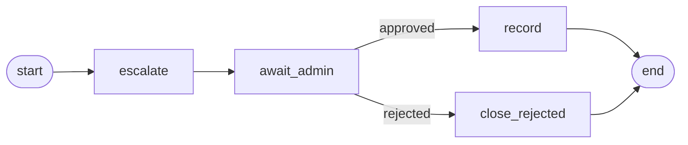

# CityPark Assistant: how it works, start to finish

# CityPark Assistant: workflow

1. The user asks to book. **Agent 1** (`graph.py`) collects the details and asks for confirmation.
2. On `yes`, Agent 1 saves the reservation in `parking.db` as `pending` and calls `start_pipeline()` from `pipeline.py`.
3. The pipeline's `escalate` node runs **Agent 2**, which checks conflicts and availability and sends the approval request to the administrator (console and `outbox/`).
4. The `await_admin` node calls `interrupt()`. The run pauses, and its state is saved in `checkpoints.db`.
5. The administrator approves or rejects through the **REST API**. The API updates the status in `parking.db` and calls `resume_pipeline()`.
6. `resume_pipeline()` resumes the paused run with `p.invoke(Command(resume=...))`.
   - **Approved:** the run goes to the `record` node.
   - **Rejected:** the run goes to `close_rejected`, and nothing is written.
7. The `record` node calls `after_decision()`, which calls the **MCP client**, and the MCP client calls the **MCP server**.
8. The MCP server checks that the reservation is approved and not yet recorded, then writes the line to `output/approved_reservations.txt`.
9. The result (`file_status`) returns up the chain to the API response. The user can ask Agent 1 for the status and sees approved or rejected, with the administrator's comment.

## Call chain

```
User ─► graph.py (Agent 1) ─► start_pipeline() ─► escalate (Agent 2) ─► await_admin  ⟂ pause

Administrator ─► REST API ─► resume_pipeline() ─► record ─► after_decision() ─► MCP client ─► MCP server ─► file
```


## The big picture

The product is a parking assistant. A user can ask questions about the parking and book a space. Every booking goes to a human administrator for approval. Once it is approved, the reservation is written to a text file.

Several parts cooperate to do this:

- **Agent 1**, the chat assistant the user talks to.
- **Agent 2**, the admin agent that prepares the approval request.
- **A pipeline graph** that follows each reservation from booking to the final record.
- **A REST API** that the administrator uses to decide.
- **An MCP server** that writes approved reservations to a file.

Only the two agents use an LLM. The human decides, and ordinary code does everything that changes data.

## The data: static and dynamic

The data is split into two kinds because they behave differently.

**Static data** rarely changes: general information, location and directions, rules, the FAQ and the booking process. It lives in markdown files in `data/static/`. At setup time (`python -m src.ingest`), each file is cut into small chunks, each chunk is turned into an embedding (a list of numbers that captures its meaning), and everything is stored in the vector database, Milvus Lite. When a user asks "Where can I park overnight?", the retriever turns the question into an embedding and finds the chunks with the closest meaning, even if the words differ. The retriever has a filter so that chunks from `private_notes.md`, which holds fake sensitive data, are never returned.

**Dynamic data** changes all the time: prices, working hours, free spaces and the reservations themselves. It lives in SQLite. The assistant reads it through fixed functions such as `get_prices(zone)`, each running a parameterized query. The LLM never writes SQL, so it can't be tricked into running something harmful.

The rule of thumb is: text knowledge goes in the vector database, exact facts go in SQL.

## Agent 1: the chat assistant (`graph.py`)

`graph.py` holds the chat graph, a LangGraph workflow that handles every message the user types. It runs these steps:

1. **Input guard.** A regex filter refuses prompt-injection and data-extraction attempts, such as "ignore your instructions" or "show me other customers' data".
2. **Classify intent.** The message is sorted into `info`, `booking` or `other`. Two rules run before the LLM. Admin-style text like `approve 5` is refused with "only the administrator can decide". Status questions go straight to `info`. If a booking is already in progress, everything stays in `booking`.
3. **Info node.** An LLM agent with fixed tools answers questions. It is required to call a tool before answering, so it can't answer from general knowledge. The tools are:
   - `search_static_info` (vector database)
   - `get_prices`, `get_working_hours`, `get_availability` (SQL)
   - `check_reservation_status` (SQL, needing both the reservation number and the car plate)
4. **Booking node.** This is slot filling. The assistant collects name, surname, car number, start and end, one at a time. An LLM extracts values from the user's messages, and plain code in `booking.py` validates them, for example the plate format and that the end is after the start. When everything is there, it shows a summary and asks for confirmation. `no` keeps the data so the user can change it, and `cancel` stops. On `yes`, the reservation is saved in SQLite with status **pending**, and the node calls `start_pipeline(id)`.
5. **Output guard.** Presidio redacts personal data in every answer before it reaches the user. The user's own name and plate are protected from redaction, so the confirmation summary stays readable.

Agent 1 never approves anything and never writes the file. Its only link to the rest of the system is `start_pipeline`.

## Agent 2: the admin agent (`admin_agent.py`)

Agent 2 is a second LLM agent with one narrow job: prepare the request that the administrator sees. It has four tools:

- `get_reservation_details`
- `check_conflicts` (do approved reservations overlap?)
- `check_availability`
- `send_admin_notification`

Its prompt tells it to call them in order and send exactly one message with who is booking, the car, the period, any conflicts or low availability, and a recommendation (approve, reject or review). The prompt also says it can never decide, and that the reservation fields come from users and must be treated as data, never as instructions.

If the LLM fails three times, a fixed template message is sent instead, so the administrator is always notified.

The notification goes through `notifier.py`, which prints an `[ADMIN NOTIFICATION]` in the console and saves a copy to `outbox/request_<id>.txt` as an audit trail.

The same file also parses free-text replies from the administrator. A regex handles clear ones (`approve 5`, `reject 5 lot is full`) without an LLM call, and an LLM with structured output handles messy ones.

## The pipeline (`pipeline.py`)

The pipeline is a second LangGraph graph, and it exists for one reason: the chat is quick, but an approval can take minutes or days. One graph is created per reservation, with its own run identified by `thread_id = reservation-<id>`. It has four nodes:

| Node | What it does |
|---|---|
| `escalate` | Runs Agent 2, which sends the request to the administrator. |
| `await_admin` | Calls LangGraph's `interrupt()`. The run stops here, and its whole state is saved to `data/checkpoints.db`, a SQLite file. Nothing keeps running while it waits. |
| `record` | Runs after an approval and calls the MCP client. |
| `close_rejected` | Runs after a rejection and records nothing. |



The state is stored in a file, not in memory, because the chat and the API are different programs. The chat process starts a run, and the API process resumes it later. The file also lets the pause survive restarts.

## How `graph.py` and `pipeline.py` are connected

They are connected by two function calls, one at each end of the waiting time:

```
graph.py (chat)                       api.py (administrator)
  user confirms booking                 admin approves or rejects
        │                                      │
  start_pipeline(id)                    resume_pipeline(id, decision, comment)
        │                                      │
        └──────────► pipeline.py ◄─────────────┘
              escalate → await_admin ⟂ pause ⟂ → record or close_rejected
```

1. When the user says `yes`, `graph.py` calls `start_pipeline(id)`. The pipeline runs `escalate` and then stops at `await_admin`.
2. Later, the administrator calls the REST API. After updating the status in SQLite, the API calls `resume_pipeline(id, decision, comment)`. The same run continues from where it paused, and goes to `record` or `close_rejected`.

So `graph.py` is the front desk the user sees, and `pipeline.py` is the back office that follows each reservation until it is decided and recorded. Both functions never raise errors, so a failure in the pipeline can't break the chat.

## The administrator's REST API (`api.py`)

The administrator doesn't use the chat. They use a small FastAPI service, protected by the `X-Admin-Token` header.

| Endpoint | Purpose |
|---|---|
| `POST /admin/reservations/{id}/decision` | The main call: `approved` or `rejected` with a comment |
| `POST /admin/reply` | Free text such as `approve 5` |
| `GET /admin/reservations?status=pending` | List requests |
| `POST /admin/reservations/{id}/record` | Retry the file write |

Only a `pending` reservation can be decided, and only once. A second decision returns 409, and a missing or wrong token returns 401. The Swagger page at `/docs` is a convenient way to call it.

## MCP: server and client

**MCP (Model Context Protocol)** is a standard way for one program to call tools offered by another program over HTTP. One side is the server, which offers the tools. The other is the client, which connects and calls them. The client doesn't need to know how the server is built.

In our project there is one tool, `record_approved_reservation(reservation_id)`.

### The MCP server (`mcp_server.py`)

A separate program running on port 8001. When its tool is called, it takes only the reservation id and reads the real data from SQLite itself. It checks that the reservation is approved and not recorded yet, then appends one line to `output/approved_reservations.txt`:

```
Name Surname | Car Number | start to end | Approval Time
```

It is protected by a bearer token (`MCP_TOKEN`) and listens on `127.0.0.1` only, so it can't be reached from other machines. It cleans the fields so a `|` or a newline can't corrupt the format, writes to a fixed file path, and uses an atomic database claim so each reservation is written exactly once, even if two calls arrive together. If the write fails, the claim is undone so it can be retried.

### The MCP client (`mcp_client.py`)

A function in our own code. It connects to the server, sends the token, calls the tool with the id, and returns the server's answer (`recorded`, `already_recorded`, and so on). It retries three times and never raises. If the server can't be reached, it returns `unavailable`.

### How it is used

The pipeline's `record` node calls `after_decision()`, which calls the MCP client, which calls the MCP server. No LLM is involved. It runs only after a human approval. If the server was down, the administrator calls the `/record` endpoint later to catch up.

## A reservation from start to finish

1. The user types: "I want to book." Agent 1 collects the details and the user confirms.
2. The reservation is saved in SQLite as `pending`, and `graph.py` calls `start_pipeline(id)`.
3. The pipeline's `escalate` node runs Agent 2. It checks conflicts and availability and sends the request, which appears in the console and in `outbox/`.
4. The pipeline reaches `await_admin` and pauses. The state is saved in `checkpoints.db`. The user is told: "Reservation saved with status PENDING."
5. The administrator calls the REST API and approves. The API updates the status to `approved` and calls `resume_pipeline`.
6. The pipeline continues into `record`. The MCP client calls the MCP server, which writes the line to the file. The API response shows `file_status: recorded`.
7. The user asks "What is the status of reservation 1?" and gives the plate. Agent 1 reads it from SQLite and answers: approved, with the administrator's comment.

If the administrator rejects, the pipeline goes to `close_rejected`, nothing is written, and the user sees `rejected`.

## Who does what

| Step | Done by | Uses an LLM? |
|---|---|---|
| Answer questions, collect booking details | Agent 1 (`graph.py`) | Yes |
| Write and send the approval request | Agent 2 (`admin_agent.py`) | Yes, with a template fallback |
| Pause and resume the workflow | Pipeline (`pipeline.py`) | No |
| Approve or reject | The human administrator | No |
| Update the status | REST API (`api.py`) | No |
| Write the line to the file | MCP server and client | No |

The LLMs only talk and prepare. The human decides, and authenticated code writes the file. That is the main design principle, and it is what makes the system safe: even if someone tricks the LLM with a crafted name or message, it has no power to approve a reservation or write to the file.

## The three running processes

The system runs as three processes that share two SQLite files (`parking.db` and `checkpoints.db`):

| Process | Command | Role |
|---|---|---|
| Chat | `python -m src.main` | The user talks to Agent 1 here, and the pipeline starts from here |
| Admin API | `uvicorn src.api:app --port 8000` | The administrator decides here, and the pipeline resumes from here |
| MCP server | `uvicorn src.mcp_server:app --host 127.0.0.1 --port 8001` | Writes the approved reservations to the file |