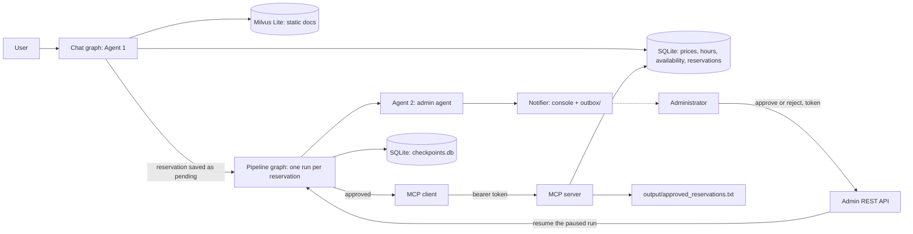
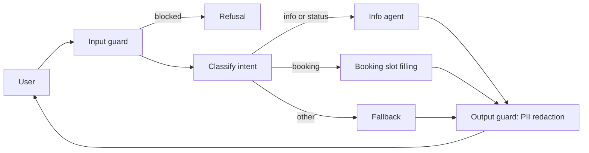
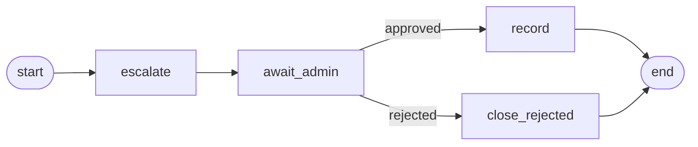
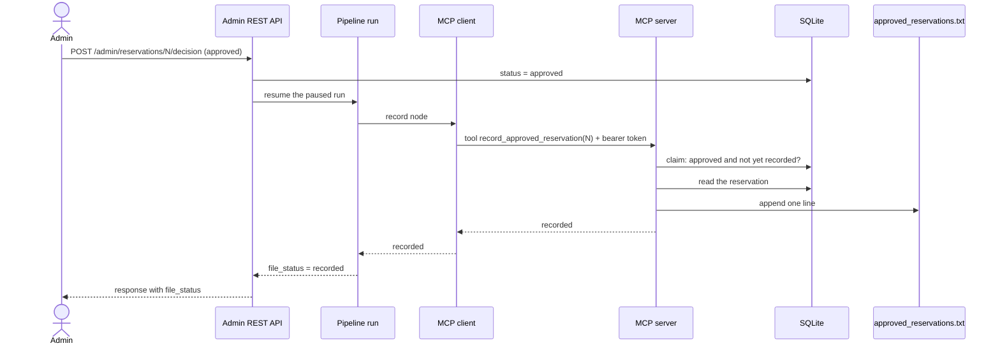

# CityPark Parking Assistant

A multi-agent chatbot for a parking facility, built with LangChain and LangGraph. It answers questions about
the parking, collects reservation requests, sends them to a human administrator for approval, and records
approved reservations in a text file through an MCP server.

The project was built in four stages. Each stage is part of the final system:

| Stage | What it adds |
|---|---|
| **1. RAG chatbot** | Agent 1 answers questions from a vector database (static data) and SQLite (dynamic data), collects reservation details, and protects sensitive data with guardrails. Includes an evaluation of the RAG system. |
| **2. Admin agent and human approval** | Agent 2 prepares an approval request for the administrator. The administrator approves or rejects through a token-protected REST API. The user can check the decision in the chat. |
| **3. MCP server** | After an approval, an MCP server writes the reservation to a text file as `Name | Car Number | Reservation Period | Approval Time`. |
| **4. LangGraph orchestration** | One LangGraph pipeline connects everything: Agent 2, a real pause for the human decision (`interrupt`), and the MCP recording. The pause is saved to disk, so it survives restarts. Includes load tests and integration tests. |

All data in the project is fictional.

## Contents

1. [Architecture](#architecture)
2. [How the system works](#how-the-system-works)
3. [Components](#components)
4. [Setup](#setup)
5. [Usage](#usage)
6. [API reference](#api-reference)
7. [Security](#security)
8. [Testing](#testing)
9. [Evaluation and load tests](#evaluation-and-load-tests)
10. [Project structure](#project-structure)
11. [Troubleshooting](#troubleshooting)
12. [Limitations](#limitations)

## Architecture

The system has two LangGraph graphs and three processes.



**Three processes** run side by side and share two SQLite files (`parking.db` and `checkpoints.db`):

| Process | Command | Role |
|---|---|---|
| Chat | `python -m src.main` | The user chat (Agent 1). Starts a pipeline run for each confirmed booking. |
| Admin API | `uvicorn src.api:app --port 8000` | The administrator's REST API. Resumes the paused run with the decision. |
| MCP server | `uvicorn src.mcp_server:app --host 127.0.0.1 --port 8001` | Writes approved reservations to the file. |

### Who decides what

| Step | Done by | Uses an LLM? |
|---|---|---|
| Answer questions, collect booking details | Agent 1 (chat graph) | Yes |
| Write and send the approval request | Agent 2 (pipeline node `escalate`) | Yes, with a template fallback |
| Approve or reject | The human administrator | No |
| Update the status, resume the pipeline | API code | No |
| Write the line to the file | MCP server | No |

The LLMs only talk and prepare. Every action that changes a decision or writes the file is done by
authenticated code after a human approval.

## How the system works

### 1. The user chats (Stage 1)



- **Input guard:** a regex filter refuses prompt-injection and data-extraction attempts.
- **Classify intent:** admin-style commands such as `approve 5` are refused ("only the administrator can
  decide"), status questions go to the info agent, and the LLM classifies everything else as `info`,
  `booking` or `other`.
- **Info agent:** an LLM with fixed tools. It must call a tool before answering.
  - `search_static_info` searches Milvus (location, rules, FAQ, booking process). Private chunks are
    excluded by a metadata filter.
  - `get_prices`, `get_working_hours`, `get_availability` run fixed, parameterized SQL queries. The LLM
    never writes SQL.
  - `check_reservation_status` needs both the reservation number and the car number.
- **Booking node:** slot filling for name, surname, car number, start and end. An LLM extracts the values,
  `booking.py` validates the plate and the date range, and the user confirms before anything is saved.
  Saying `no` keeps the data for changes, and `cancel` stops the flow.
- **Output guard:** Presidio redacts personal data in every answer. The user's own booking data (name and
  plate) is protected from redaction so the confirmation summary stays readable.

### 2. A confirmed booking starts a pipeline run (Stages 2, 3 and 4)

After the user says `yes`, the reservation is saved with status `pending` and `start_pipeline(id)` starts a
run of the pipeline graph. Each reservation has its own run, identified by `thread_id = reservation-<id>`.



| Node | What it does |
|---|---|
| `escalate` | Agent 2 reads the reservation, checks conflicts and availability, and sends the approval request with a recommendation. If the LLM fails three times, a fixed template is sent instead. |
| `await_admin` | Calls LangGraph's `interrupt()`. The run stops here and its state is saved in `data/checkpoints.db`. This is the human-in-the-loop step. |
| `record` | Runs after an approval. Calls the MCP client, which asks the MCP server to write the line. |
| `close_rejected` | Runs after a rejection. Nothing is recorded. |

### 3. The administrator decides

The administrator sees the request in the console and in `outbox/request_<id>.txt`, then calls the REST API
with the `X-Admin-Token` header. The API updates the status in SQLite (only a `pending` reservation can be
decided, once) and resumes the paused run with `Command(resume=...)`. The same run continues in the API
process, even though the chat process started it, because the state is in the shared checkpoint file.

If there is no paused run for a reservation (for example one created before Stage 4), the API falls back to
calling the Stage 3 recording step directly.

### 4. The MCP server records the reservation



Each line has the format:

```
Name | Car Number | Reservation Period | Approval Time
Sandro Chopika | SS-000-SS | 2026-10-12 14:00 to 2026-10-13 14:00 | 2026-10-06 15:42:16
```

### 5. The user sees the result

The user asks "What is the status of reservation N?" and gives the car number. The bot reports `pending`,
`approved` or `rejected` and any administrator comment.

## Components

### Data

- **Static data** (general info, location, rules, FAQ, booking process) is chunked, embedded with
  `all-MiniLM-L6-v2`, and stored in Milvus Lite. `private_notes.md` contains invented sensitive data used
  only to demonstrate the guardrails.
- **Dynamic data** lives in SQLite: prices, working hours, availability and reservations.

### Agent 1: chat graph (`src/graph.py`)

The LangGraph flow described above, with an in-memory checkpointer for the conversation. It never
approves anything and never writes the file. Its only link to the rest of the system is
`start_pipeline(id)`.

### Agent 2: admin agent (`src/admin_agent.py`)

A LangChain agent with four tools: `get_reservation_details`, `check_conflicts`, `check_availability` and
`send_admin_notification`. The prompt tells it to call each tool in order, send exactly one message, and
treat reservation fields as data, never as instructions. It can recommend but never decide.

The same module parses free-text replies from the administrator: a regex handles clear replies such as
`approve 5` or `reject 5 lot is full` offline, and an LLM with structured output is the fallback for free text.

### Pipeline (`src/pipeline.py`)

The Stage 4 LangGraph graph with the four nodes above. `start_pipeline` runs it until the pause, and
`resume_pipeline` continues it with the human decision. Both never raise. The checkpoint is a SQLite file,
because the chat and the API are different processes and an in-memory checkpointer could not be shared.

### Notifier (`src/notifier.py`)

Prints the approval request as `[ADMIN NOTIFICATION]` and saves a copy to `outbox/request_<id>.txt` as an
audit trail. Another channel (email, Slack) can replace its body without touching the agent.

### MCP server (`src/mcp_server.py`) and client (`src/mcp_client.py`)

The server is built with the official `mcp` Python SDK over HTTP. It has one tool,
`record_approved_reservation(reservation_id)`. It takes only an id, reads the real data from SQLite
itself, checks that the reservation is approved and not yet recorded, and appends one line. The client
sends the bearer token, retries three times, and never raises. If the server is down it returns
`unavailable`.

### Guardrails (`src/guardrails.py`)

Regex input filter, private chunks excluded at retrieval, fixed tools only, and Presidio PII redaction on
every output.

## Setup

Requires Python 3.11.

```bash
python -m venv .venv
.venv\Scripts\Activate.ps1
pip install -r requirements.txt
python -m spacy download en_core_web_lg
```

`requirements.txt` pins `mcp<2`, because mcp 2.x renamed `FastMCP` and changed other APIs.

Create `.env` in the project root:

```
GROQ_API_KEY=your_key
MODEL=groq:openai/gpt-oss-120b
ADMIN_TOKEN=put-a-long-random-string-here
MCP_TOKEN=put-a-different-long-random-string-here
```

| Variable | Required | Meaning |
|---|---|---|
| `GROQ_API_KEY` | yes | API key of the LLM provider |
| `MODEL` | no | Model for `init_chat_model` (default `groq:openai/gpt-oss-120b`). Any LangChain provider works. |
| `ADMIN_TOKEN` | yes | Token for the administrator REST API (`X-Admin-Token` header) |
| `MCP_TOKEN` | yes | Bearer token for the MCP server. The API and the MCP server must see the same value. |
| `MCP_URL` | no | MCP endpoint (default `http://127.0.0.1:8001/mcp`) |
| `APPROVED_FILE` | no | Output file (default `output/approved_reservations.txt`) |
| `ADMIN_URL` | no | API address used by the load test (default `http://127.0.0.1:8000`) |

Generate strong tokens with `python -c "import secrets; print(secrets.token_urlsafe(32))"`.

Prepare the data once:

```bash
python data/seed.py          # create SQLite tables and sample data (rebuilds the database)
python -m src.ingest         # embed static docs into Milvus Lite
```

`data/seed.py` also deletes `data/checkpoints.db`. Reseeding restarts reservation ids at 1, so old pipeline
runs must not survive it.

## Usage

Start the three processes in three terminals, each with the virtual environment active:

| Terminal | Command |
|---|---|
| 1 | `uvicorn src.mcp_server:app --host 127.0.0.1 --port 8001` |
| 2 | `uvicorn src.api:app --port 8000` |
| 3 | `python -m src.main` |

The first start of the chat takes up to a minute while Presidio and its models load.

### End-to-end demo

1. In the chat, book a space and confirm with `yes`. The `[ADMIN NOTIFICATION]` message appears in the
   console, `outbox/request_<id>.txt` holds a copy, and the pipeline pauses at `await_admin`.
2. Check the pause in another terminal:
   ```bash
   python -c "from src.pipeline import get_pipeline, _config; print(get_pipeline().get_state(_config(1)).next)"
   ```
   It prints `('await_admin',)`.
3. Open `http://localhost:8000/docs`, click **Authorize**, and paste `ADMIN_TOKEN`. List pending reservations
   with `GET /admin/reservations?status=pending`.
4. Approve with `POST /admin/reservations/{id}/decision` and the body
   `{"decision": "approved", "comment": "Welcome!"}`. The response contains `"file_status": "recorded"`.
5. Run the check from step 2 again. It prints `()`, so the run has finished.
6. Open `output/approved_reservations.txt` and find the line.
7. In the chat, ask "What is the status of reservation 1?" and give the car number. The bot reports
   `approved` with the comment.

### Failure cases worth trying

- Call the API without a token: `401`. Call the MCP server without a token
  (`curl -i -X POST http://127.0.0.1:8001/mcp`): `401`.
- Approve the same reservation twice: `409`, and the file still has one line.
- Reject a reservation: `file_status` is `not_needed` and no line is written.
- Type `approve 1` in the user chat: refused, only the administrator can decide.
- Stop the MCP server and approve a reservation: `file_status` is `unavailable`. Restart the server and call
  `POST /admin/reservations/{id}/record` to get `recorded`.
- Restart the API process between the booking and the approval. The approval still works, because the
  pause is stored in `data/checkpoints.db`.

### Other commands

```bash
pytest -q                                    # run the test suite
python -m eval.run_eval                      # RAG evaluation (add --skip-e2e to skip LLM calls)
python -m eval.load_test mcp --n 30 --workers 10     # load test: MCP recording
python -m eval.load_test admin --n 30 --workers 10   # load test: administrator approval
python -m eval.load_test chat --users 3              # load test: interactive chat
```

The `admin` and `mcp` load tests create real rows and file lines. Afterwards run `python data/seed.py` and
delete `output/approved_reservations.txt`.

Example questions for the chat: "What are the prices in Zone C?", "Is there EV charging?",
"Are there free spaces?", "I want to book a space.", "What is the status of reservation 1?"

## API reference

All admin endpoints require the `X-Admin-Token` header. Interactive docs are at `http://localhost:8000/docs`.

| Endpoint | Purpose |
|---|---|
| `GET /admin/reservations?status=pending` | List reservations, optionally filtered by status |
| `POST /admin/reservations/{id}/decision` | Structured decision: `{"decision": "approved" or "rejected", "comment": "..."}` |
| `POST /admin/reply` | Free-text reply such as `approve 5` or `reject 5 lot is full`, parsed by regex first and an LLM as fallback |
| `POST /admin/reservations/{id}/record` | Retry writing an approved reservation to the file (for example after the MCP server was down) |

The decision response includes `file_status`:

| Value | Meaning |
|---|---|
| `recorded` | The line was written to the file |
| `already_recorded` | The reservation was written before, nothing added |
| `not_needed` | The reservation was rejected |
| `unavailable` | The MCP server could not be reached. Use the `/record` endpoint later. |

Status codes: `401` missing or wrong token, `404` unknown reservation, `409` reservation already decided.

The MCP server exposes one tool over HTTP at `/mcp`: `record_approved_reservation(reservation_id)`, returning
`recorded`, `already_recorded`, `not_approved` or `not_found`.

## Security

- **The LLM never decides and never writes the file.** Agent 2 can only write and send the request.
  Decisions come only from the administrator through the authenticated API, and the file is written by
  code after an approval. This matters because reservation fields are user-controlled text.
- **Two separate tokens.** `ADMIN_TOKEN` protects the REST API and `MCP_TOKEN` protects the MCP server.
  Missing or wrong tokens return `401` (compared in constant time). The MCP server rejects every request
  without a token, including the root path.
- **MCP server bound to `127.0.0.1`**, so it is reachable only from the same machine.
- **One-time decisions.** Only a `pending` reservation can be decided, and a second decision returns `409`.
- **Idempotent recording.** An atomic database claim marks an approved reservation as recorded, so each
  reservation is written once, even under concurrent calls. If the write fails, the claim is released.
- **The MCP server does not trust its caller.** The tool takes only an id. Data comes from the database,
  only approved reservations are written, the output path is fixed in configuration, and `|` and newlines
  are stripped from fields so they cannot break the line format or inject fake lines.
- **Status needs both the reservation id and the car number**, so users cannot read other people's reservations.
- **Admin commands typed into the chat are refused.**
- **Data protection:** private chunks are excluded at retrieval, the LLM uses fixed tools instead of raw SQL,
  and Presidio redacts personal data in outputs.
- **Reliability:** `escalate`, `start_pipeline`, `resume_pipeline` and the MCP client never raise, so a failure
  in one component cannot break the chat. The client retries, and the pipeline pause survives restarts.

## Testing

`pytest -q` runs the whole suite offline, with no LLM calls and no running servers. Autouse fixtures in
`tests/conftest.py` replace the real MCP call and use an in-memory checkpointer, so tests never touch the
real checkpoint file.

| Test file | What it covers |
|---|---|
| `test_db.py`, `test_booking.py`, `test_guardrails.py`, `test_retriever.py`, `test_graph.py` | Stage 1: queries, booking validation, redaction, retrieval with the private filter, graph routing |
| `test_db_admin.py` | One-time decisions, status needs a matching plate, conflicts count only approved reservations |
| `test_notifier.py` | Outbox file and console output, directory creation and overwrite |
| `test_admin_agent.py` | Reply parsing, database update from a reply, fallback template when the agent fails, `after_decision`, the `on_decided` callback |
| `test_api.py` | `401` without a token, list and decide, `409` on a second decision, `404` on an unknown id, `file_status` |
| `test_mcp_server.py` | Line format, pending, unknown and duplicate reservations are not written, sanitized fields, claim released after a write failure, `401` without a token |
| `test_mcp_client.py` | Returns the server's status, retries and then reports `unavailable` |
| `test_pipeline.py` | **Integration tests of the whole workflow:** the run pauses until the administrator decides, an approval resumes it and writes the file, a rejection ends it without a file, a free-text reply resumes it, fallback without a paused run, `start_pipeline` never raises |

CI runs the suite with GitHub Actions on every push (`.github/workflows/ci.yml`).

## Evaluation and load tests

**RAG evaluation (Stage 1).** Chunk size 300 with k=3 gives Recall@3 0.84, Precision@3 0.58 and MRR 0.83 on
a 30-question golden set. Retrieval takes about 15 ms; end-to-end latency (dominated by the LLM) has a median
of about 2 to 5 s. The input filter blocks 10/10 direct attacks and 2/10 paraphrased ones, but no secret
leaked end to end in any of the 10 paraphrased attacks. Details are in [EVALUATION.md](EVALUATION.md).

**Load tests (Stage 4).** `eval/load_test.py` measures latency (p50, p95, max), throughput and errors for
each component:

- `chat`: several simulated users, each in their own conversation, asking three questions.
- `admin`: concurrent approvals through the running API, including the MCP write, followed by a check that
  the file has one line per approval.
- `mcp`: concurrent calls to the MCP server, followed by a repeat-call check that duplicates are refused.

Results and notes are in [LOAD_TEST.md](LOAD_TEST.md).

## Project structure

```
data/static/         markdown docs for the vector DB (private_notes.md is fake sensitive data)
data/seed.py         creates and fills the SQLite database, deletes the old checkpoint file
src/ingest.py        chunk, embed, store in Milvus
src/retriever.py     retriever with a public-only filter
src/db.py            parameterized SQL queries, decisions, conflict checks, recording claims
src/booking.py       booking validation (plate, dates)
src/guardrails.py    input filter and PII redaction
src/graph.py         chat graph (Agent 1)
src/admin_agent.py   admin agent (Agent 2): escalation, reply parsing, after_decision
src/pipeline.py      pipeline graph: escalate, await_admin (interrupt), record, close_rejected
src/notifier.py      delivers approval requests to the console and outbox/
src/api.py           token-protected FastAPI app for the administrator
src/mcp_server.py    MCP server that writes approved reservations to a file
src/mcp_client.py    MCP client with retries
src/main.py          CLI chat loop
eval/run_eval.py     RAG evaluation
eval/load_test.py    load tests for chat, admin approval and MCP recording
eval/golden_set.json golden questions for the RAG evaluation
tests/               pytest suite
.github/workflows/   CI
output/              approved_reservations.txt (generated, not committed)
outbox/              approval requests sent to the administrator (generated, not committed)
EVALUATION.md        RAG evaluation report
LOAD_TEST.md         load test results
```

Files that must never be committed: `.env`, `outbox/`, `output/`, `*.db` (including `data/checkpoints.db`)
and the Milvus files. They are listed in `.gitignore`.

## Troubleshooting

| Problem | Cause and fix |
|---|---|
| `ModuleNotFoundError: mcp.server.fastmcp` | mcp 2.x is installed. Run `pip install "mcp<2"`. |
| `file_status` is `unavailable` or `(MCP call failed: ExceptionGroup)` | The MCP server is not running, or `MCP_TOKEN` differs between the API and the MCP server. Start the server and restart both processes after changing `.env`. |
| `401` from the API | Missing or wrong `X-Admin-Token`. Use **Authorize** in Swagger. |
| The chat takes a minute to start | Presidio and its models load on first import. Wait for the prompt. |
| `no such column` errors | The database was created before a schema change. Run `python data/seed.py`. |
| `database is locked` under heavy load | Several processes write to the same SQLite file. See the limitations. |
| A reservation shows no paused run | It was created before Stage 4, or after a reseed deleted `checkpoints.db`. The API then uses the Stage 3 path. |

## Limitations

- The pipeline state and the reservations are stored in SQLite files shared by three processes. That is fine on
  one machine, but a production system would use Postgres and a durable queue.
- The user learns the outcome only by asking, because the CLI chat has no push channel. A WebSocket or a
  background poll could be a next step.
- Admin delivery is console and file only. An email or Slack notifier could replace `send_to_admin`.
- The MCP token is static and traffic is plain HTTP on localhost. For production you would use TLS and
  rotating credentials.
- A hard crash between the recording claim and the file write could leave a reservation marked as recorded but
  missing from the file. Ordinary write failures release the claim.
- The output is a plain text file with no rotation. A real system would use a database or object storage.
- The chat conversation uses an in-memory checkpointer, so conversations are lost on restart. Pipeline runs are not.
- The load tests are a script, not a full tool such as Locust, and the chat test is limited by the LLM
  provider's rate limits.
- Reservations are not tied to a specific zone.