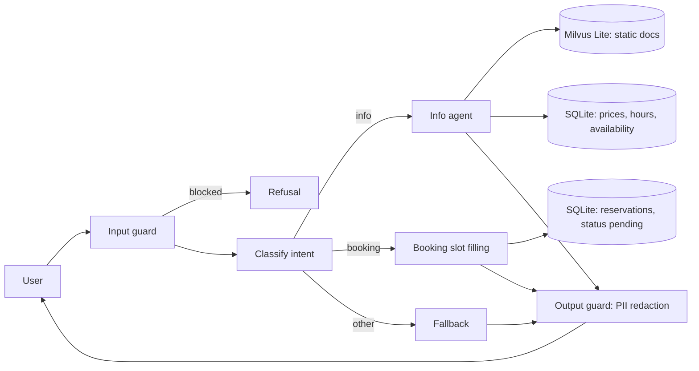

# CityPark Parking Assistant (Stage 1)

A RAG chatbot that answers questions about a parking facility and collects reservation
requests. Static knowledge (location, rules, FAQ) lives in a vector database, dynamic data
(prices, hours, availability) in SQLite, and guardrails protect sensitive data.
All data is fictional.

## Architecture



- **Static data** (general info, location, rules, FAQ, booking process) is chunked, embedded
  with `all-MiniLM-L6-v2`, and stored in Milvus Lite.
- **Dynamic data** is read through fixed, parameterized SQL functions. The LLM never writes SQL.
- **Booking** is a slot-filling flow (name, surname, car number, start, end) with validation and a
  confirmation step. Confirmed requests are saved as `pending` for administrator approval (later stages).
- **Guardrails:** regex input filter, private chunks excluded at retrieval, fixed tools only,
  and Presidio PII redaction on every output (the user's own booking data is allowed).

## Setup

Requires Python 3.11.

```bash
python -m venv .venv
.venv\Scripts\Activate.ps1          
pip install -r requirements.txt
python -m spacy download en_core_web_lg
```

Create `.env`:

```
GROQ_API_KEY=your_key
MODEL=groq:openai/gpt-oss-120b
```

Any provider supported by LangChain's `init_chat_model` works; install its package and change `MODEL`.

## Usage

```bash
python data/seed.py          # create SQLite tables and sample data
python -m src.ingest         # embed static docs into Milvus Lite
python -m src.main           # start the chat
python -m eval.run_eval      # run the evaluation (add --skip-e2e to skip LLM calls)
pytest -q                    # run tests
```

Example questions: "What are the prices in Zone C?", "Is there EV charging?",
"Are there free spaces?", "I want to book a space."

## Project structure

```
data/static/       markdown docs for the vector DB (private_notes.md is fake sensitive data)
data/seed.py       creates and fills the SQLite database
src/ingest.py      chunk, embed, store in Milvus
src/retriever.py   retriever with a public-only filter
src/db.py          parameterized SQL queries
src/booking.py     booking validation (plate, dates)
src/guardrails.py  input filter and PII redaction
src/graph.py       LangGraph flow
src/main.py        CLI chat loop
eval/              golden set and evaluation script
tests/             pytest suite
EVALUATION.md      evaluation report
```

## Evaluation summary

Chunk size 300 with k=3 gives Recall@3 0.84, Precision@3 0.58 and MRR 0.83 on a 30-question
golden set. Retrieval takes about 15 ms; end-to-end latency (dominated by the LLM) has a median of
about 2-5 s. The input filter blocks 10/10 direct attacks and 2/10 paraphrased ones, but no secret
leaked end to end in any of the 10 paraphrased attacks. Details and limitations are in
[EVALUATION.md](evaluation.md).

## Notes

- Milvus Lite is used, so no server is needed. 
- `private_notes.md` contains invented data used only to demonstrate the guardrails.