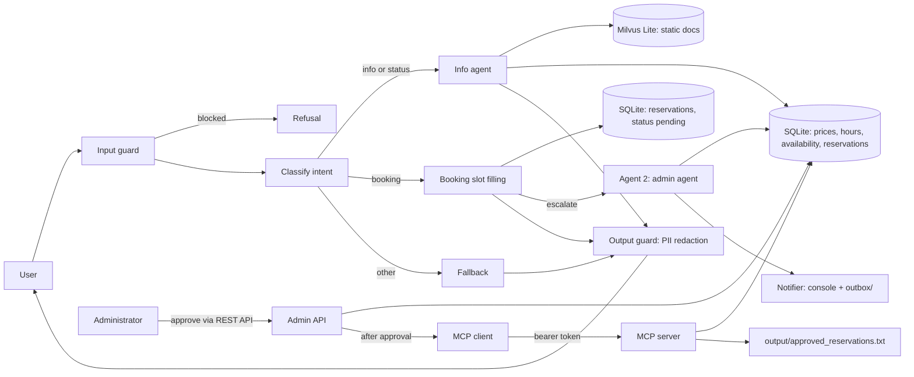
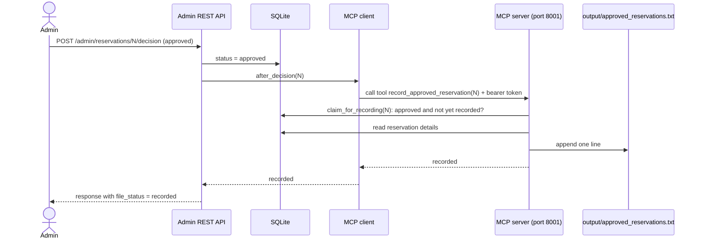

# CityPark Parking Assistant

A multi-agent chatbot for a parking facility.

- **Stage 1:** a RAG chatbot (Agent 1) answers questions and collects reservation requests.
- **Stage 2:** an admin agent (Agent 2) escalates each reservation to a human administrator,
  who approves or rejects it through a token-protected REST API. The user can then check the decision in the chat.
- **Stage 3:** once the administrator approves a reservation, an MCP server writes it to a text file
  as `Name | Car Number | Reservation Period | Approval Time`.

Static knowledge (location, rules, FAQ) lives in a vector database, dynamic data (prices, hours,
availability, reservations) in SQLite, and guardrails protect sensitive data. All data is fictional.

## Architecture



- **Static data** (general info, location, rules, FAQ, booking process) is chunked, embedded
  with `all-MiniLM-L6-v2`, and stored in Milvus Lite.
- **Dynamic data** is read through fixed, parameterized SQL functions. The LLM never writes SQL.
- **Booking** is a slot-filling flow (name, surname, car number, start, end) with validation and a
  confirmation step. Confirmed requests are saved as `pending` and escalated to the administrator.
- **Guardrails:** regex input filter, private chunks excluded at retrieval, fixed tools only,
  and Presidio PII redaction on every output (the user's own booking data is allowed).

## Stage 2: Admin agent and human approval

### How the two agents communicate

Agent 1 calls `escalate(reservation_id)` after saving a reservation. Agent 2 is a LangChain agent with
four tools: `get_reservation_details`, `check_conflicts`, `check_availability` and
`send_admin_notification`. It writes a short request with a recommendation (approve, reject or review).
The two agents share the SQLite `reservations` table.

If the LLM fails three times, `escalate()` sends a deterministic template message instead, so the
administrator is always notified. `escalate()` never raises, so a failure in Agent 2 cannot break the chat.

### Administrator channel

The administrator receives the request in the console and in `outbox/request_<id>.txt` (kept as an
audit trail). The reply goes through the REST API.

| Endpoint | Purpose |
|---|---|
| `GET /admin/reservations?status=pending` | List reservations, optionally filtered by status |
| `POST /admin/reservations/{id}/decision` | Structured decision: `{"decision": "approved" or "rejected", "comment": "..."}` |
| `POST /admin/reply` | Free-text reply such as `approve 5` or `reject 5 lot is full`, parsed by the admin agent |
| `POST /admin/reservations/{id}/record` | Retry writing an approved reservation to the file (Stage 3) |

All endpoints require the `X-Admin-Token` header. Interactive docs are at `http://localhost:8000/docs`
(click **Authorize** and paste the token).

Example:

```bash
curl -X POST http://localhost:8000/admin/reservations/1/decision \
  -H "X-Admin-Token: <ADMIN_TOKEN>" \
  -H "Content-Type: application/json" \
  -d '{"decision": "approved", "comment": "Welcome!"}'
```

Reply parsing uses a regex first (fast, works offline) and falls back to an LLM with structured output
for free text.

### Checking the result as a user

Ask the chat: "What is the status of reservation 1?" The bot asks for the reservation number and the
car number used when booking, then reports `pending`, `approved` or `rejected` and any administrator comment.

### Security notes

- **The LLM never decides.** Agent 2 can only write and send the request. Decisions come only from the
  administrator through the authenticated API. This matters because reservation fields are user-controlled text.
- **Token-protected API.** A missing or wrong token returns `401` (compared in constant time).
- **One-time decisions.** Only a `pending` reservation can be decided, and a second decision returns `409`.
- **Status needs both the reservation id and the car number**, so users can't read other people's reservations.
- **Admin commands typed into the chat are refused.** A message like `approve 5` in the user chat gets a
  clear "only the administrator can decide" reply.

## Stage 3: MCP server for approved reservations

Once the administrator approves a reservation, a small MCP server writes it to a text file.
Each line has the format:

```
Name | Car Number | Reservation Period | Approval Time
Sandro Chopikashvili | SS-000-SS | 2026-10-12 14:00 to 2026-10-13 14:00 | 2026-10-06 15:42:16
```

### Flow



### What each piece does

- **MCP server (`src/mcp_server.py`):** a small server built with the official `mcp` Python SDK
  (streamable HTTP). It has one tool, `record_approved_reservation(reservation_id)`. It takes only an id,
  reads the real data from SQLite itself, and writes the line. The caller cannot make it write arbitrary
  text or choose the file path.
- **MCP client (`src/mcp_client.py`):** the code on the agent side that calls the server's tool. It sends
  the bearer token, retries 3 times, and never raises. If the server is down, it returns `unavailable`.
- **Hook into Stage 2 (`after_decision` in `src/admin_agent.py`):** after a human approval, the reservation
  is handed to the MCP client. Rejections do nothing (`not_needed`). The API response includes
  `file_status` (`recorded`, `already_recorded`, `unavailable`, `not_needed`), and `POST /admin/reply`
  reports the same in its message.
- **Database changes (`src/db.py`, `data/seed.py`):** a new `recorded_at` column and two functions.
  `claim_for_recording` marks an approved reservation as recorded in a single atomic SQL statement, and
  `release_claim` undoes it if the file write fails. This prevents duplicate lines.
- **Catch-up endpoint:** `POST /admin/reservations/{id}/record` retries the file write, for the case where
  the MCP server was down at approval time.

### Security and reliability

- **Bearer token (`MCP_TOKEN`)**, separate from `ADMIN_TOKEN`. Without it, every request to the MCP server
  gets `401`, including the root path and the favicon.
- **Localhost only.** The server is bound to `127.0.0.1`, so it is reachable only from the same machine.
- **Approved only, and only once.** The server re-reads the reservation from the database, writes only
  approved reservations, and an atomic claim makes sure each one is written a single time.
- **Sanitized fields.** A `|` or a newline in a name or plate can't break the line format or inject fake lines.
- **Fixed output path** from configuration. Callers can never choose where the server writes.
- **The LLM never triggers a write.** A human approval does, deterministically.
- **Retries and rollback.** The client retries, the claim is released if the write fails, and the
  `/record` endpoint covers the case where the server was down.

## Setup

Requires Python 3.11.

```bash
python -m venv .venv
.venv\Scripts\Activate.ps1
pip install -r requirements.txt
python -m spacy download en_core_web_lg
```

`requirements.txt` pins `mcp<2`, because mcp 2.x renamed `FastMCP` and changed other APIs.

Create `.env`:

```
GROQ_API_KEY=your_key
MODEL=groq:openai/gpt-oss-120b
ADMIN_TOKEN=put-a-long-random-string-here
MCP_TOKEN=put-a-different-long-random-string-here
```

Optional settings (defaults shown):

```
MCP_URL=http://127.0.0.1:8001/mcp
APPROVED_FILE=output/approved_reservations.txt
```

Any provider supported by LangChain's `init_chat_model` works; install its package and change `MODEL`.
Use long random values for the two tokens, for example the output of
`python -c "import secrets; print(secrets.token_urlsafe(32))"`. The API and the MCP server must see the
same `MCP_TOKEN`.

## Usage

Prepare the data once:

```bash
python data/seed.py          # create SQLite tables and sample data (rebuilds the database)
python -m src.ingest         # embed static docs into Milvus Lite
```

Run the demo in three terminals, each with the virtual environment active:

| Terminal | Command | What it is |
|---|---|---|
| 1 | `python -m src.main` | The user chat (Agent 1) |
| 2 | `uvicorn src.api:app --port 8000` | The administrator REST API |
| 3 | `uvicorn src.mcp_server:app --host 127.0.0.1 --port 8001` | The MCP server |

Demo steps:

1. In the chat, make a booking and confirm. The `[ADMIN NOTIFICATION]` message appears in the console and
   `outbox/request_<id>.txt` holds a copy.
2. Open `http://localhost:8000/docs`, authorize with `ADMIN_TOKEN`, and list pending reservations.
3. Approve the reservation with `POST /admin/reservations/{id}/decision`. The response contains
   `"file_status": "recorded"`.
4. Open `output/approved_reservations.txt`. It has one line for the reservation.
5. In the chat, ask for the status of the reservation and give your car number.

Failure cases worth trying:

- Call the MCP server without a token (`curl -i -X POST http://127.0.0.1:8001/mcp`): `401`.
- Approve the same reservation twice: `409`, and the file still has one line.
- Reject a reservation: no line is written (`file_status` is `not_needed`).
- Stop the MCP server and approve a reservation: `file_status` is `unavailable`. Restart the server and call
  `POST /admin/reservations/{id}/record` to get `recorded`.

Other commands:

```bash
python -m eval.run_eval      # run the evaluation (add --skip-e2e to skip LLM calls)
pytest -q                    # run tests
```

Example questions: "What are the prices in Zone C?", "Is there EV charging?",
"Are there free spaces?", "I want to book a space.", "What is the status of reservation 1?"

## Project structure

```
data/static/         markdown docs for the vector DB (private_notes.md is fake sensitive data)
data/seed.py         creates and fills the SQLite database
src/ingest.py        chunk, embed, store in Milvus
src/retriever.py     retriever with a public-only filter
src/db.py            parameterized SQL queries, reservation decisions, conflict checks, recording claims
src/booking.py       booking validation (plate, dates)
src/guardrails.py    input filter and PII redaction
src/graph.py         LangGraph flow (Agent 1)
src/admin_agent.py   admin agent (Agent 2): escalation, notification, reply parsing, after_decision
src/notifier.py      delivers approval requests to the console and outbox/
src/api.py           token-protected FastAPI app for the administrator
src/mcp_server.py    MCP server that writes approved reservations to a file
src/mcp_client.py    MCP client with retries, used after an approval
src/main.py          CLI chat loop
eval/                golden set and evaluation script
tests/               pytest suite
output/              approved_reservations.txt (generated, not committed)
EVALUATION.md        evaluation report
```

## Tests

`pytest -q` runs the whole suite offline, with no LLM calls and no running servers (43 tests).
A fixture in `tests/conftest.py` replaces the real MCP call, so the suite stays fast.

Stage 2 tests:

- `tests/test_db_admin.py`: one-time decisions, status lookup needs a matching plate, conflicts count only approved reservations
- `tests/test_notifier.py`: outbox file and console output, directory creation and overwrite
- `tests/test_admin_agent.py`: reply parsing, database update from a reply, fallback template when the agent fails
- `tests/test_api.py`: `401` without a token, list and decide, `409` on a second decision and `404` on an unknown id

Stage 3 tests:

- `tests/test_mcp_server.py`: line format, pending, unknown and duplicate reservations are not written, sanitized fields, claim released after a write failure, `401` without a token
- `tests/test_mcp_client.py`: returns the server's status, retries and then reports `unavailable`
- `tests/test_admin_agent.py`: `after_decision` acts only on approvals and never raises
- `tests/test_api.py`: the decision response reports `file_status`, and a rejection does not touch the file

## Evaluation summary

Chunk size 300 with k=3 gives Recall@3 0.84, Precision@3 0.58 and MRR 0.83 on a 30-question
golden set. Retrieval takes about 15 ms; end-to-end latency (dominated by the LLM) has a median of
about 2-5 s. The input filter blocks 10/10 direct attacks and 2/10 paraphrased ones, but no secret
leaked end to end in any of the 10 paraphrased attacks. Details and limitations are in
[EVALUATION.md](EVALUATION.md).

## Limitations

- The user learns the outcome only by asking, because the CLI chat has no push channel. A WebSocket or a
  background poll could be a next step.
- Admin delivery is console and file only. An email or Slack notifier could replace the body of
  `send_to_admin` in `src/notifier.py` without touching the agent.
- The MCP token is static and traffic is plain HTTP on localhost. For production you would use TLS and
  rotating credentials.
- A hard crash between the claim and the file write could leave a reservation marked as recorded but missing
  from the file. Ordinary write failures are handled by releasing the claim.
- The output is a plain text file with no rotation. A real system would use a database or object storage.
- SQLite is shared by several processes (chat, API, MCP server), which is fine on one machine. A server
  database would be the production choice.
- `MemorySaver` and the in-memory set of sent requests do not survive restarts.
- Reservations are not tied to a specific zone.

## Notes

- Milvus Lite is used, so no server is needed.
- `private_notes.md` contains invented data used only to demonstrate the guardrails.
- Do not commit `.env`, `outbox/`, `output/` or any `*.db` file.